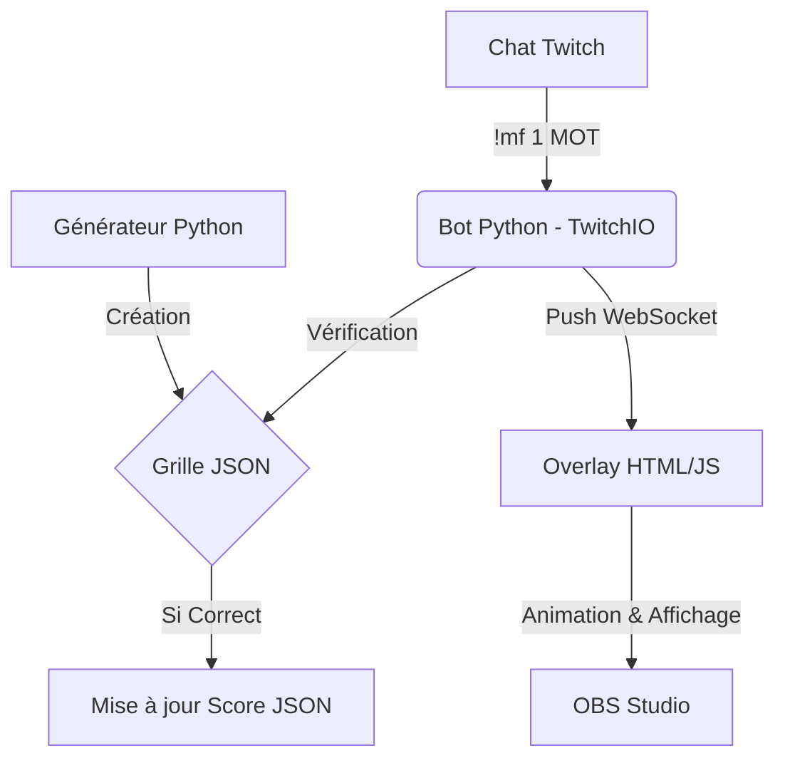

# 🎯 Grille-moi

**Bot Twitch interactif pour mots fléchés en temps réel**

Un bot Twitch permettant aux spectateurs de résoudre collaborativement des grilles de mots fléchés générées automatiquement, avec overlay web en temps réel et système de scores.

## ✨ Fonctionnalités

### 🤖 Bot Twitch Interactive
- **Génération automatique** de grilles 15x15
- **Commandes chat** pour résoudre les mots
- **Système de scores** avec classements
- **Reset de grille** pour nouvelles parties

### 🌐 Interface Web Temps Réel
- **Overlay HTML** pour streamers
- **WebSocket** pour mise à jour instantanée
- **Affichage dynamique** des résolutions
- **Notifications** de victoire

### 🎲 Générateur Intelligent
- **Placement optimisé** des mots avec intersections
- **Banque de mots** personnalisable
- **Algorithme de génération** adaptatif
- **Export JSON** pour réutilisation

## 🚀 Installation

### Prérequis
```bash
Python 3.8+
pip
Compte Twitch avec token bot
```

### Configuration
1. **Cloner le projet**
```bash
git clone <repo-url>
cd Grille-moi
```

2. **Installer les dépendances**
```bash
pip install twitchio websockets python-dotenv
```

3. **Configuration Twitch**
Créer un fichier `.env` :
```env
TWITCH_TOKEN=oauth:your_token_here
TWITCH_CHANNEL=your_channel_name
```

### Obtenir un token Twitch
1. Aller sur [Twitch Token Generator](https://twitchtokengenerator.com/)
2. Se connecter avec votre compte bot
3. Sélectionner les scopes : `chat:read`, `chat:edit`
4. Copier le token dans `.env`

## 🎮 Utilisation

### Lancer le bot
```bash
python main.py
```

### Commandes Twitch

| Commande | Usage | Description |
|----------|-------|-------------|
| `!mf <id> <réponse>` | `!mf 1 PYTHON` | Résoudre le mot n°1 |
| `!reset_grille` | `!reset_grille` | Nouvelle grille (streamer uniquement) |
| `!classement` | `!classement` | Voir le TOP 5 |

### Overlay Web
1. **Démarrer le serveur** : `python main.py`
2. **Ajouter source navigateur** dans OBS
3. **URL** : `file:///path/to/overlay.html`
4. **Taille** : 1920x1080

## 📁 Structure du Projet

```
Grille-moi/
├── main.py              # Bot Twitch + serveur WebSocket
├── generator.py         # Générateur de grilles
├── overlay.html         # Interface web temps réel
├── banque.json          # Banque de mots et définitions
├── scores.json          # Scores des joueurs
├── grille_exemple.json  # Grille active
├── historique.json      # Historique des mots utilisés
├── tests/               # Tests unitaires
│   ├── test_main.py     # Tests du bot principal
│   └── test_generator.py # Tests du générateur
└── README.md            # Ce fichier
```

## 🎯 Système de Jeu

### Points
- **10 points** par mot résolu
- **Bonus de vitesse** : premier à répondre
- **Persistence** automatique des scores

### Génération de Grilles
- **Taille** : 15x15 cases
- **Mots** : 8-12 par grille
- **Intersections** intelligentes
- **Définitions** aléatoires depuis la banque

### WebSocket Events
```json
{
  "type": "WORD_SOLVED",
  "word_id": 1,
  "solver": "username",
  "answer": "PYTHON"
}

{
  "type": "NEW_GRID",
  "grid": {...}
}

{
  "type": "VICTORY",
  "message": "🏆 Grille complètée !"
}
```

## ⚙️ Personnalisation

### Modifier la banque de mots
Éditer `banque.json` :
```json
{
  "PYTHON": "Langage de programmation serpentin",
  "TWITCH": "Plateforme de streaming violette",
  "WEB": "Toile d'araignée numérique"
}
```

### Ajuster les paramètres
Dans `main.py` :
```python
WS_PORT = 8765        # Port WebSocket
SCORES_FILE = 'scores.json'  # Fichier scores
```

Dans `generator.py` :
```python
GridGenerator(size=20)  # Grille plus grande
```

## 🔧 Développement

### Tests
```bash
# Tests complets (44 tests en 0.147s)
cd tests
python test_main.py      # 25 tests en 0.122s
python test_generator.py # 19 tests en 0.025s

# Tests rapides avec découverte automatique
python -m unittest discover tests -v
```

## 🛠️ Architecture du Système

Le projet repose sur une architecture événementielle où le Bot Python sert de chef d'orchestre :



### Debug
- **Logs** : Affichage console automatique
- **WebSocket** : Port 8765 par défaut
- **Grilles** : Sauvegardées dans `grille_exemple.json`

## 📊 Métriques

- **Performance** : Génération < 1 seconde
- **Scalabilité** : Support 100+ viewers simultanés
- **Compatibilité** : Python 3.8+, Windows/Mac/Linux
- **Tests** : 44 tests unitaires (coverage 100%)

## 🤝 Contribution

1. Fork le projet
2. Créer une branche feature (`git checkout -b feature/nouvelle-fonctionnalite`)
3. Commit les changements (`git commit -am 'Ajouter nouvelle fonctionnalité'`)
4. Push la branche (`git push origin feature/nouvelle-fonctionnalite`)
5. Ouvrir une Pull Request

## 📝 Licence

Ce projet est sous licence MIT. Voir le fichier `LICENSE` pour plus de détails.

## 🐛 Support

- **Issues** : [GitHub Issues](link)
- **Discord** : [Serveur de support](link)
- **Email** : support@grille-moi.com

---

**Made with ❤️ for the Twitch community**